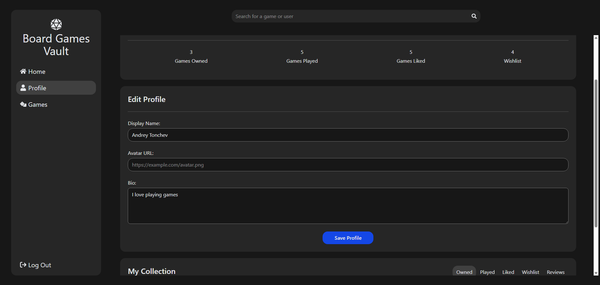
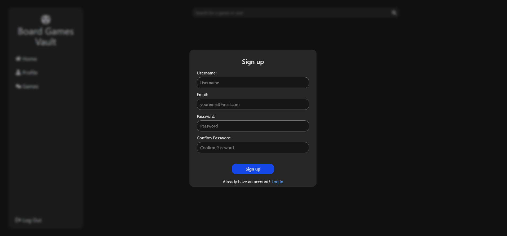

## Board Games Vault: A Letterboxd-Inspired Platform for Board Game Enthusiasts

## Project Overview

Board Games Vault is a web application designed for board game enthusiasts to catalog, rate, and review their favorite games. Inspired by the film platform Letterboxd, this project provides a social experience where users can:

- Browse popular board games
- Search and filter games by various criteria
- Track personal collections (Played, Liked, Owned, Wishlist)
- Rate games and write reviews
- Follow other users and view their activity
- Discover new games through social recommendations

## Technical Implementation

### Frontend

- **React**: Single-page application built with modern React and hooks
- **React Router**: Routing with data loading capabilities
- **Tailwind CSS**: Styling with utility-first approach
- **React Icons**: For a consistent UI experience

### Backend

- **Supabase**: PostgreSQL database with authentication and real-time capabilities
- **Supabase Auth**: User authentication and session management
- **BoardGameGeek API**: External data source for game information

## Database Structure

The application uses several key tables:

1. **user_profiles**: Extended user information
2. **user_games**: Tracks which games users have in their collections
3. **user_content**: Reviews and ratings submitted by users
4. **user_follows**: Social connections between users

    

## Application Structure

- **Home Page**: Shows popular games and activity from followed users
  
- **Games Page**: Browse and search for games with filtering options
  
- **Game Page**: Detailed information about individual games with reviews
  
  
  
- **Profile Page**: User profiles with collections and activity
  
  
- **Authentication**: Login and signup functionality
  
  

```jsx
const router = createBrowserRouter([
    {
        element: <AppLayout />,
        children: [
            {
                path: '/',
                element: <Home />,
                loader: homeLoader,
            },
            {
                path: '/games',
                children: [
                    {
                        index: true,
                        element: <PopularGames />,
                        loader: popularGamesLoader,
                    },
                    {
                        path: ':query',
                        element: <SearchResults />,
                        loader: searchLoader,
                    },
                ],
            },
            {
                path: '/login',
                element: <Login />,
            },
            {
                path: '/signup',
                element: <Signup />,
            },
            {
                path: '/profile/:userId',
                element: <Profile />,
                loader: profileLoader,
            },
            {
                path: '/game/:gameId',
                element: <GamePage />,
                loader: gameLoader,
            },
        ],
    },
]);
```

## Key Features

### Collection Management

Users can add games to different collections:

- ✅ Played
- ❤️ Liked
- 📚 Owned
- 🛒 Wishlist

### Social Features

- Follow other users
- See their reviews and collections
- Discover new games through friends' activities

### Game Discovery

- Browse popular games
- Search by title
- Filter by type and other criteria
- Sort by different parameters

### Reviews and Ratings

- Rate games on a 10-point scale with half-star precision
- Write detailed reviews
- View community ratings and reviews

## Future Enhancements

- Advanced statistics for user collections
- Custom lists and recommendations
- Game session logging
- Integration with more board game APIs
- Mobile app development`
